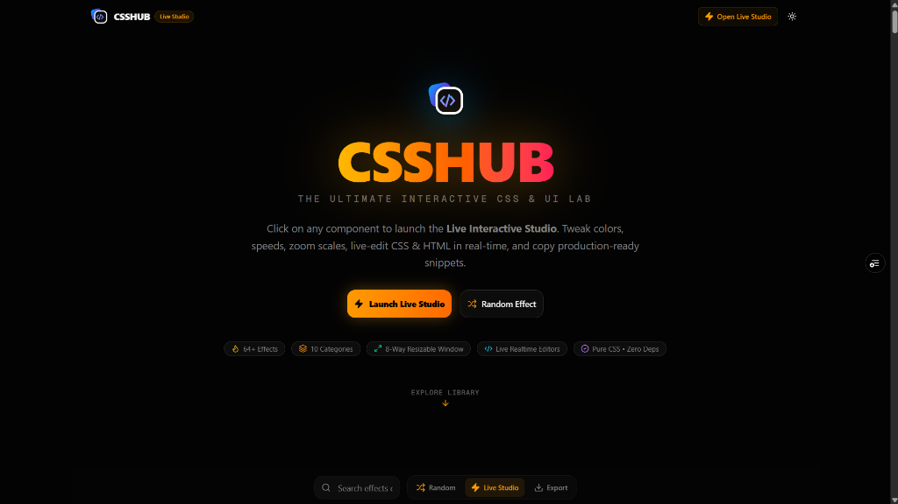
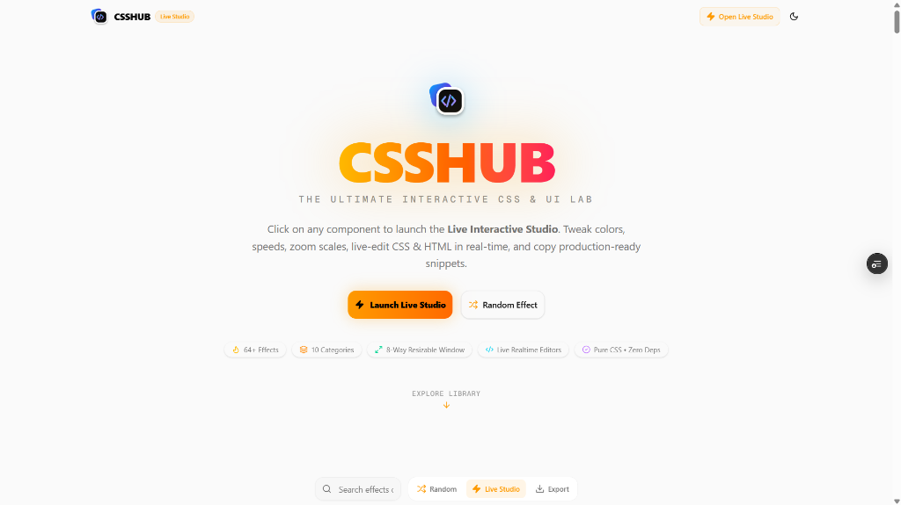
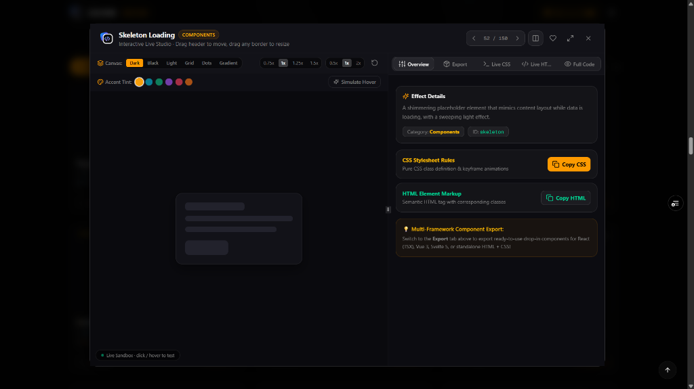
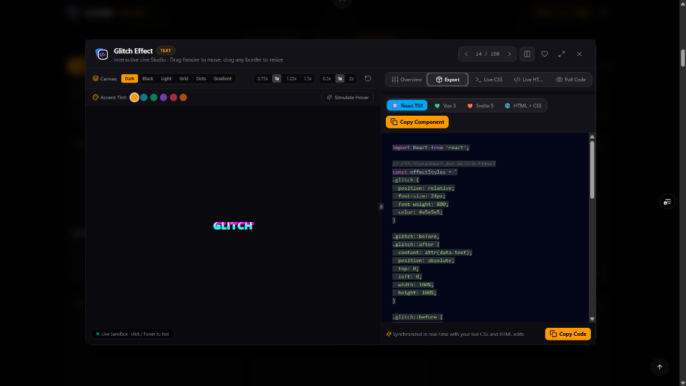
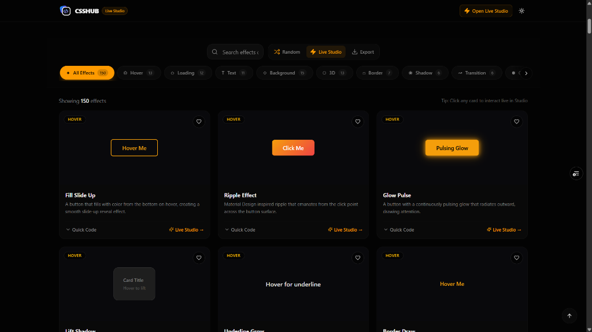

# CSSHUB 🎨✨

A modern, interactive CSS & UI Effects Library and Live Studio featuring **150+ production-ready CSS effects** across 10 categories. Built with **Next.js 16 (Turbopack)**, **React 19**, **Tailwind CSS v4**, and **Framer Motion**.



---

## 🚀 Key Features

- **📱 Fully Mobile & Desktop Responsive**:
  - **Mobile (< 768px)**: Automatically switches to an adaptive full-screen studio app shell with a touch-friendly segmented tab bar (`Canvas`, `Details`, `Export`, `Live CSS`, `Live HTML`, `Code`).
  - **Desktop (≥ 768px)**: 8-way resizable sandbox that can be resized from all 4 borders and 4 corners, dragged by its header, or maximized to fullscreen.
- **📌 Persistent Sticky Search & Category Bar**: Fluid, translucent glassmorphism bar with smooth horizontal category swiping that sticks right below the header on scroll.
- **🔝 Instant Return to Top**: Click the logo or brand text in the top navigation bar, hero, or footer to smoothly scroll back to top.
- **↔️ Draggable Split-Pane Divider**: Adjust canvas vs editor widths freely with instant reactive resizing on desktop.
- **⚛️ Multi-Framework Code Exporter**: 1-click export for **React (TSX)**, **Vue 3 SFC**, **Svelte 5 Runes**, and standalone **HTML + CSS**.
- **🎨 Real-Time CSS & HTML Live Editors**: Edit CSS stylesheet rules and HTML element markup in real-time with instant hot preview.
- **🌈 Canvas Customizer & Environment Themes**: Preview components in Dark, Pitch Black, Light, Grid, Dotted Matrix, or Gradient themes.
- **⚡ Accent Tint & Speed Controls**: Dynamically change accent color palettes, adjust animation speeds (0.5x, 1x, 2x), and zoom scales (0.75x to 1.5x).
- **🔒 Simulate Hover Lock**: Lock and inspect hover animations continuously without keeping your mouse on the element (essential for mobile & touch testing).
- **🏹 Infused Category Navigation Bar**: Smooth scrolling category pills with integrated `<` and `>` arrow controls and subtle edge fades.
- **⌨️ Keyboard Navigation**: Press `←` and `→` in the Live Studio to effortlessly browse and test all 150+ effects in interactive mode.
- **♥ Favorites System**: Save and filter your favorite effects using persistent local storage.
- **📦 1-Click Copy & Export**: Instant 1-click copy for pure CSS, HTML, and all modern frameworks.
- **🌙 Dark & Light Mode**: Built-in sleek dark theme and crisp light theme with zero-flicker transitions.

---

## 📸 Screenshots & Previews

| 🌌 Dark Mode Hero & Ambience | ☀️ Crisp Light Theme Mode |
| :---: | :---: |
|  |  |

| ⚡ Live Studio Overview & 1-Click Copy | ⚛️ Multi-Framework Exporter (React / Vue / Svelte) |
| :---: | :---: |
|  |  |

<p align="center">
  <b>📌 Scrolled 150+ Effects Grid &amp; Sticky Category Bar</b><br/>
  
</p>

---

## 🗂️ Effect Categories (150+ Production-Ready Effects)

1. **Hover Effects (15 Effects)**: Spotlight Border Glow, 3D Isometric Cube Button, Dual Curtain Reveal, Glitch Cyberpunk Button, Magnetic Gravity Pill, Liquid Gel Morph, Magnetic Ambient Glow, Glow, Underline Reveal, Lift, Border Expand, Shine Sweep, Tilt, 3D Flip, Neon Pulse
2. **Loading Spinners (14 Effects)**: 3D DNA Double Helix, Planetary Orbit Rings, Morphing Geometric Spinner, Liquid Pulsing Dots, Cyber Radar Scanner, Liquid Wave Fill, Dual Ring, Ripple Pulse, Dot Bounce, Orbit, Gradient Spinner, Bar Wave, Infinity Loop, Hourglass
3. **Text Effects (13 Effects)**: Matrix Cipher Decryption, Liquid Wave Fill Text, 80s Chrome Metallic, Kinetic Elastic Bounce, Neon Gas Burn-In, Gradient Text, Typing Effect, Glitch, Neon Glow, Wave Text, Shimmer, 3D Shadow, Smoke Dissolve
4. **Backgrounds (15 Effects)**: Quantum Particle Field, Vintage CRT Scanlines, Cybernetic Hex Mesh, Flowing Lava Lamp, Deep Space Nebula Drift, Matrix Digital Rain, Deep Space Warp, Conic Gradient Vortex, Synthwave Cyber Grid, Animated Gradient, Dot Matrix, Diagonal Stripes, Aurora, Geometric Pattern, Flowing Waves
5. **3D Effects (15 Effects)**: 3D Isometric Device Mockup, 3D Rotating Showcase Cube, Origami 3D Accordion Fold, 3D Parallax Depth Layers, 3D Wireframe Globe, 3D Exploded Layer Stack, 3D Revolving Cylinder Carousel, Perspective Card, Isometric Grid, Cube Rotate, Parallax Float, Cylinder Roll, Flip Card, Floating Spheres, 3D Depth Button
6. **Borders (14 Effects)**: Electrified PCB Circuit Border, Conic Glow Radiant Border, HUD Corner Targeting Brackets, Dual Neon Laser Chase, Liquid Blob Border, Laser Beam Travelling Border, Gradient Border, Dashed March, Corner Accents, Snake Border, Rainbow Glow, Double Offset, Pulsing Border, Neon Frame
7. **Shadows (12 Effects)**: 3D Chromatic Shadow Separation, Glass Caustic Refraction Shadow, Pulsing Ambient Shadow, 90s Brutalist Offset Solid, Neumorphic, Multi-Layer Depth, Colored Glow, Inner Depth, Long Shadow, Floating Shadow, Prism Shadow, Inset Glow
8. **Transitions (12 Effects)**: 8-Bit Pixel Dissolve, Radial Iris Circular Wipe, Vertical Venetian Blind Louvers, 3D Room Perspective Flip, Slide Reveal, Curtain Open, Zoom Bounce, Elastic Pop, Page Curl, Diagonal Wipe, Morph Shape, Spring In
9. **Components (40 Modern UI Components)**: Command Menu Palette (`⌘K`), IDE Interactive File Tree, Split Action Button, Multi-Step Wizard Bar, Interactive Pricing Slider, Activity Stream Timeline, Color Swatch Wheel Selector, Glassmorphic Consent Pill, Apple Dynamic Island Capsule, macOS Magnification Dock, Radial Action Wheel Menu, Frosted Code Snippet Window, Frosted Glass Modal Dialog, Glassmorphic Vinyl Music Player, Cyberpunk Glass Card, Sparkline Stat Metric Card, SaaS Pricing Tier Card, Spotlight Search Bar (`⌘K`), Floating Speed Dial (FAB), Interactive Avatar Stack, Apple Segmented Control, Audio Waveform Player, Split-Flap Countdown Timer, Floating Glass Consent Banner, Floating Label Input, Sliding Pill Tab Bar, Animated Accordion, Step Progress Tracker, Notification Toast, OTP Verification Boxes, File Upload Dropzone, Bento Spotlight Card, Toggle Switch, Animated Checkbox, Circular Progress Ring, Skeleton Loader, Tooltip, Badge Pulse, Rating Stars, Range Slider
10. **Advanced (15 Effects)**: Liquid Glass Glint Refraction, Multi-Band Audio Visualizer, Living SVG Spline Mesh, Holographic ID Security Badge, Iridescent Holographic Foil Card, Cyberpunk RGB Glitch Card, Glassmorphism Frost, Text Reveal Mask, Marquee Scroller, Morphing Blob, Card Spotlight, Noise Grain Texture, Neon Cyber Button, Video/Image Text Mask

---

## 🛠️ Tech Stack

- **Framework**: [Next.js 16](https://nextjs.org/) (App Router & Turbopack)
- **UI & Styling**: [React 19](https://react.dev/), [Tailwind CSS v4](https://tailwindcss.com/), [Radix UI](https://radix-ui.com/), [Lucide Icons](https://lucide.dev/)
- **Split Panels**: [react-resizable-panels](https://github.com/bvaughn/react-resizable-panels)
- **Animations**: [Framer Motion](https://www.framer.com/motion/) & Pure CSS3 Animations
- **State Management**: [Zustand](https://zustand-demo.pmnd.rs/) (with LocalStorage persistence)
- **Syntax Highlighting**: [React Syntax Highlighter](https://github.com/react-syntax-highlighter/react-syntax-highlighter) (Prism engine)

---

## 🏁 Getting Started

### 1. Clone the repository
```bash
git clone https://github.com/07adarsh1/CSS-Effects-Library.git
cd CSS-Effects-Library
```

### 2. Install dependencies
```bash
npm install
```

### 3. Run the development server
```bash
npm run dev
```

Open [http://localhost:3000](http://localhost:3000) in your browser to view CSSHUB.

### 4. Build for Production
```bash
npm run build
npm run start
```

---

## 📁 Project Structure

```
CSSHUB/
├── public/
│   ├── logo.svg
│   └── screenshots/              # Screenshots and visual previews
├── src/
│   ├── app/                      # Next.js App Router (layout.tsx, page.tsx, globals.css)
│   ├── components/
│   │   ├── css-effects/          # CSSHUB components (EffectsShowcase, LiveStudioModal, EffectCard, etc.)
│   │   └── ui/                   # Radix UI primitives (button, resizable, dialog, tabs, tooltip, etc.)
│   ├── hooks/                    # Custom React hooks (use-mobile, use-toast)
│   ├── lib/                      # Data & state (effects-data, effects-extra-data, store, export-generators)
│   └── styles/                   # CSS rules (effects.css, effects-extra.css)
├── components.json
├── eslint.config.mjs
├── next.config.ts
├── package.json
├── postcss.config.mjs
├── README.md
├── tailwind.config.ts
└── tsconfig.json
```

---

## 📄 License

MIT License. Free for personal and commercial use!
