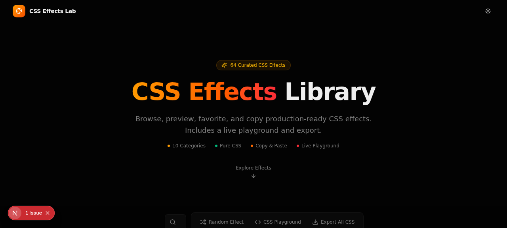
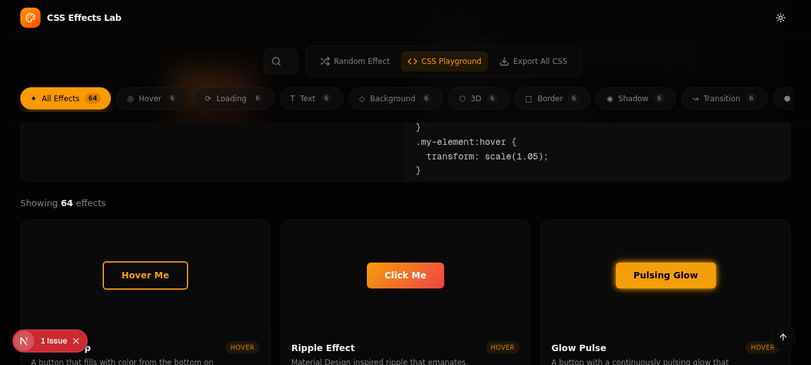
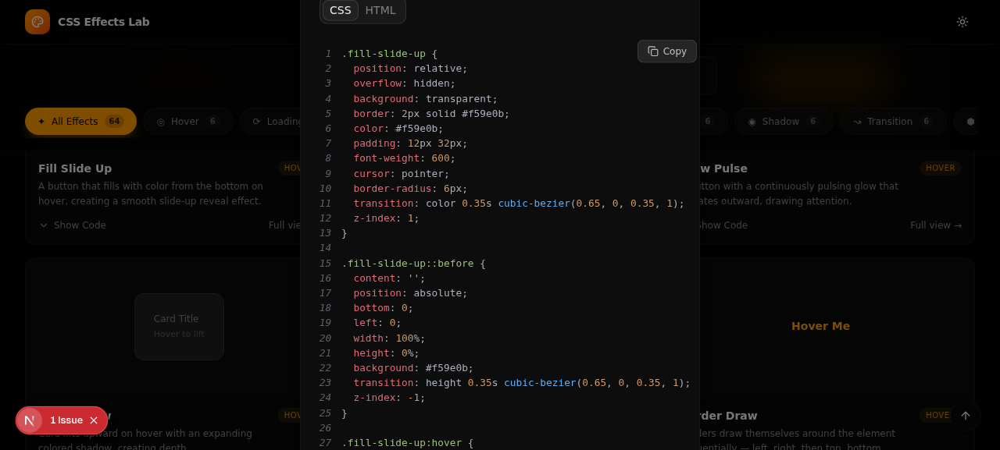
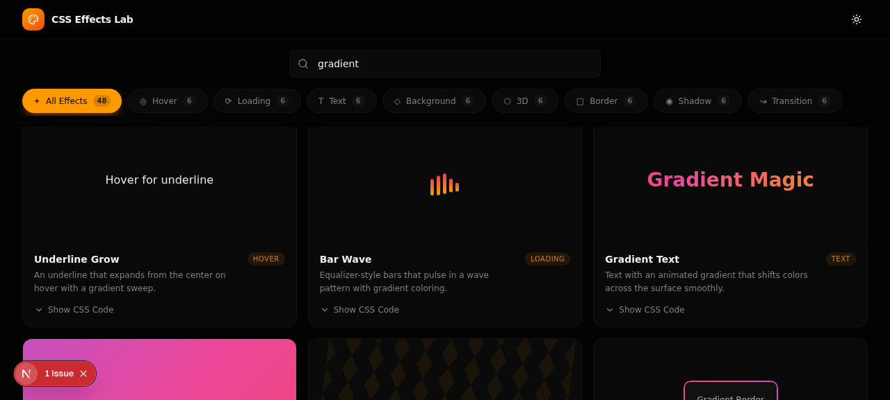

# CSS-Effects-Library 🎨✨

A curated, interactive CSS & UI Effects Library and Playground with **64+ production-ready CSS effects** across 10 categories, built with Next.js 16, React 19, Tailwind CSS, and Framer Motion.



---

## 🚀 Features

- **⚡ Live Interactive Studio for Every Component**: Click any component or card to open a full-featured live interactive studio. Tweak colors, animation speeds, zoom scales, canvas themes, and edit CSS & HTML in real-time with instant hot preview!
- **64+ Curated CSS Effects**: Hover effects, loading spinners, glowing borders, glassmorphism, 3D cards, text animations, UI components, and advanced effects.
- **Interactive CSS Playground**: Preset-enabled live sandbox with dual HTML & CSS editors and split live rendering.
- **Keyboard Navigation**: Press `←` and `→` in the Live Studio to effortlessly browse and test all 64 effects in interactive mode.
- **Favorites System**: Save and filter your favorite effects using persistent local storage.
- **Export All CSS**: Download or copy all 64 CSS effect rules directly for your own projects.
- **Dark & Light Mode**: Built-in sleek dark theme and crisp light theme.
- **Search & Multi-Category Filter**: Instant search by effect name or category tag.

---

## 📸 Screenshots

| Hero & Showcase | Live CSS Playground |
| :---: | :---: |
|  |  |

| Code Modal & Syntax Highlighting | Dark Theme Showcase |
| :---: | :---: |
|  |  |

---

## 🗂️ Effect Categories

1. **Hover Effects**: Glow, Underline Reveal, Lift, Border Expand, Shine Sweep, Tilt, 3D Flip, Neon Pulse
2. **Loading Spinners**: Dual Ring, Ripple Pulse, Dot Bounce, Orbit, Gradient Spinner, Bar Wave, Infinity Loop, Hourglass
3. **Text Effects**: Gradient Text, Typing Effect, Glitch, Neon Glow, Wave Text, Shimmer, 3D Shadow, Smoke Dissolve
4. **Backgrounds**: Mesh Gradient, Animated Grid, Starfield, Particle Float, Aurora Borealis, Wave Pattern, Radial Pulse, Diagonal Stripes
5. **3D Effects**: Perspective Card, Isometric Grid, Cube Rotate, Parallax Float, Cylinder Roll, Flip Card, Floating Spheres, 3D Depth Button
6. **Borders**: Gradient Border, Dashed March, Corner Accents, Snake Border, Rainbow Glow, Double Offset, Pulsing Border, Neon Frame
7. **Shadows**: Neumorphic, Multi-Layer Depth, Colored Glow, Inner Depth, Long Shadow, Floating Shadow, Prism Shadow, Inset Glow
8. **Transitions**: Slide Reveal, Curtain Open, Zoom Bounce, Elastic Pop, Page Curl, Diagonal Wipe, Morph Shape, Spring In
9. **Components**: Toggle Switch, Checkbox Animation, Circular Progress, Skeleton Loader, Tooltip, Badge Pulse, Rating Stars, Range Slider
10. **Advanced**: Glassmorphism Frost, Text Reveal Mask, Marquee Scroller, Morphing Blob, Card Spotlight, Noise Grain Texture, Neon Cyber Button, Video/Image Text Mask

---

## 🛠️ Tech Stack

- **Framework**: [Next.js 16](https://nextjs.org/) (App Router)
- **UI & Components**: [React 19](https://react.dev/), [Tailwind CSS v4](https://tailwindcss.com/), [Radix UI](https://radix-ui.com/), [Lucide Icons](https://lucide.dev/)
- **Animations**: Framer Motion & Pure CSS3
- **State Management**: [Zustand](https://zustand-demo.pmnd.rs/) (with LocalStorage persist)
- **Code Highlighting**: [React Syntax Highlighter](https://github.com/react-syntax-highlighter/react-syntax-highlighter)

---

## 🏁 Getting Started

### 1. Clone the repository
```bash
git clone https://github.com/07adarsh1/CSS-Effects-Library.git
cd CSS-Effects-Library
```

### 2. Install dependencies
```bash
npm install
# or
bun install
```

### 3. Run the development server
```bash
npm run dev
# or
bun dev
```

Open [http://localhost:3000](http://localhost:3000) in your browser to view the library.

---

## 📁 Project Structure

```
├── public/
│   ├── logo.svg
│   ├── robots.txt
│   └── screenshots/        # Feature & demo screenshots
├── src/
│   ├── app/
│   │   ├── globals.css     # Theme & base styles
│   │   ├── layout.tsx      # Root layout & font definitions
│   │   └── page.tsx        # Main application page
│   ├── components/
│   │   ├── css-effects/    # Effect cards, showcase, modals & playground
│   │   └── ui/             # Radix UI primitives & design components
│   ├── hooks/              # Custom React hooks (toast, mobile)
│   ├── lib/
│   │   ├── effects-data.ts # Metadata and code for effects (1-48)
│   │   ├── effects-extra-data.ts # Metadata and code for effects (49-64)
│   │   ├── store.ts        # Zustand favorites store
│   │   └── utils.ts        # Utility functions (cn helper)
│   └── styles/
│       ├── effects.css     # CSS rules for effects 1-48
│       └── effects-extra.css # CSS rules for effects 49-64
├── package.json
├── tailwind.config.ts
└── tsconfig.json
```

---

## 📄 License

MIT License. Free for personal and commercial use!
